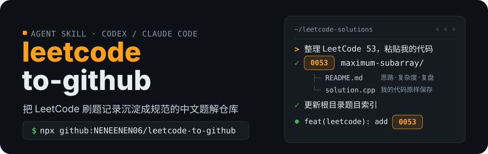
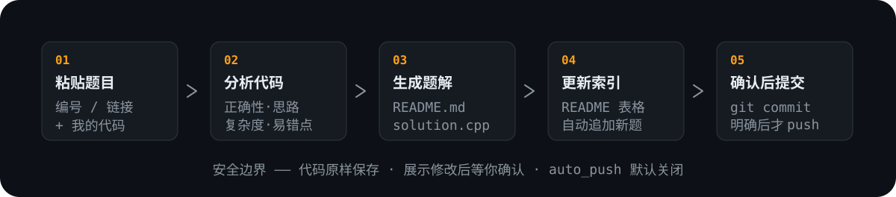

<p align="center">
  
</p>

## 它是什么

一个 Agent Skill（Codex / Claude Code 等主流 Agent 通用）。你只管刷题——把题号和代码发给 Agent，它负责分析你的代码、按统一模板撰写中文题解、更新题目索引，并在你确认后提交到 GitHub 仓库。

## 会得到什么

每道题生成一个独立目录；题解包含题目、我的思路、代码、代码分析、复杂度、易错点、总结、复盘；根目录索引由脚本自动维护。

```text
leetcode-solutions/
├── 0001-two-sum/
│   ├── README.md        题解：思路 · 代码分析 · 复杂度 · 复盘
│   └── solution.cpp     你的原始代码，原样保存
├── 0053-maximum-subarray/
│   ├── README.md
│   └── solution.cpp
└── README.md            题目索引（脚本自动更新）
```

## 工作流程

<p align="center">
  
</p>

## 快速开始

### 1. 安装

用 npx 从 GitHub 一键安装，自动检测已安装的 Agent（优先 Codex），装到对应 skills 目录：

```bash
npx github:NENEENEN06/leetcode-to-github
```

- Codex：`$CODEX_HOME/skills/leetcode-to-github`（默认 `~/.codex/skills/...`）
- Claude Code：`$CLAUDE_CONFIG_DIR/skills/leetcode-to-github`（默认 `~/.claude/skills/...`）

指定 Agent，或装到任意目录（任何 Agent 通用）：

```bash
npx github:NENEENEN06/leetcode-to-github --agent codex
npx github:NENEENEN06/leetcode-to-github --agent claude
npx github:NENEENEN06/leetcode-to-github --dest <该 Agent 的 skills 目录>
```

检测到旧安装会先备份再覆盖。安装后重启对应 Agent，提及 `leetcode-to-github` 即可触发（Codex 亦可写 `$leetcode-to-github`）。`SKILL.md` 采用 `name`/`description` 通用格式，主流 Agent 都能识别。本地调试可在仓库根目录运行 `node cli.js`。

### 2. 配置

编辑 [config.yaml](config.yaml)，至少填好：

```yaml
repository:
  owner: YOUR_GITHUB_USERNAME   # 改成你的 GitHub 用户名
  name: leetcode-solutions      # 改成你的仓库名
  root: ""                      # 题解放在仓库根目录；如放在 solutions/ 下填 solutions
  local_path: ""                # 本地克隆路径，例如 C:/Users/you/leetcode-solutions
  default_branch: main
```

不要把 GitHub Token、密码写进 `config.yaml`。认证交给 `git` 凭据助手或 `gh auth login`。

### 3. 连接 GitHub

1. 在 GitHub 上创建一个空仓库，例如 `leetcode-solutions`。
2. 克隆到本地，并把路径填进 `config.yaml` 的 `local_path`：

   ```bash
   git clone https://github.com/<你的用户名>/leetcode-solutions.git
   ```

3. 用任一方式完成认证：
   - 已安装 GitHub CLI：`gh auth login`（推荐）
   - 或配置凭据助手：`git config --global credential.helper store`，首次 push 时输入 Token

之后 Agent 会先在 `local_path` 目录里核对 `git remote -v` 与分支，再执行提交。

### 4. 第一次使用

装好 skill、填好 `config.yaml`、准备一个本地仓库（可为空克隆），然后对 Agent 说：

````text
整理 LeetCode 53
我的代码：
```cpp
class Solution {
public:
    int maxSubArray(vector<int>& nums) {
        int cur = nums[0], best = nums[0];
        for (int i = 1; i < nums.size(); ++i) {
            cur = max(nums[i], cur + nums[i]);
            best = max(best, cur);
        }
        return best;
    }
};
```
````

Agent 会生成 `0053-maximum-subarray/README.md` 和 `solution.cpp`，更新根索引，展示修改并等待你确认。可以运行校验脚本复核：

```bash
python scripts/validate.py --repo <仓库路径> --config config.yaml
```

## 更多用法

**仅整理（不提交）：**

> 整理 LeetCode 1，代码：...（粘贴代码）

Agent 生成 `0001-two-sum/`，更新索引，展示修改，等你确认后才 commit，且默认不 push。

**整理并提交：**

> 整理并提交 LeetCode 206，代码：...

Agent 完成检查后直接 commit（不 push，除非 `auto_push: true` 或你明确说"推送"）。

**批量整理：**

> 整理这些题：
> LeetCode 1
> 代码：...
>
> LeetCode 20
> 代码：...
>
> LeetCode 206
> 代码：...

Agent 逐题生成，最后汇总：

```text
本次整理：
✓ 0001 Two Sum
✓ 0020 Valid Parentheses
✓ 0206 Reverse Linked List

共 3 道题。
```

**更新已存在的题：**

如果 `0053-maximum-subarray/` 已存在，Agent 会先列出已有文件和检测到的新代码，询问"是否更新现有解法？"，确认后才修改，提交信息为 `refactor(leetcode): improve 0053 maximum subarray`。

## 脚本

```bash
# 校验目录命名、README 段落、solution 文件、重复题号、敏感信息
python scripts/validate.py --repo <仓库路径> --config config.yaml

# 生成 / 更新根目录题目索引
python scripts/generate_index.py --repo <仓库路径> --config config.yaml
```

两个脚本只使用 Python 标准库，无第三方依赖。

## 安全说明

- 默认 `auto_push: false`，只有明确说"推送 / 提交到 GitHub"才 push。
- 用户代码原样保存，不修改、不替换；题解记录你的真实解法。
- 只有实际运行过代码才声称"通过编译/测试"，否则如实写"无法确定"。
- 提交前用 `validate.py` 检查敏感信息，不提交 Token / 密钥 / 密码。

## 仓库结构

```text
leetcode-to-github/
├── SKILL.md              Skill 行为、工作流程、分析规则与 GitHub 操作规则
├── config.yaml           仓库、目录、文档、Git 与语言扩展名配置（无敏感信息）
├── package.json          npm 包元数据，供 npx 安装使用
├── cli.js                npx 入口：把技能文件安装到 Agent 的 skills 目录
├── templates/
│   ├── solution.md       单题题解模板
│   └── index.md          仓库根目录索引模板
├── references/
│   ├── algorithms.md     双指针、滑动窗口、二分、DP、DFS/BFS 等模式参考
│   └── complexity.md     复杂度分析参考
├── scripts/
│   ├── validate.py       校验目录 / README / 敏感信息 / 重复题号
│   └── generate_index.py 生成 / 更新根目录题目索引
└── assets/readme/        README 视觉素材
```